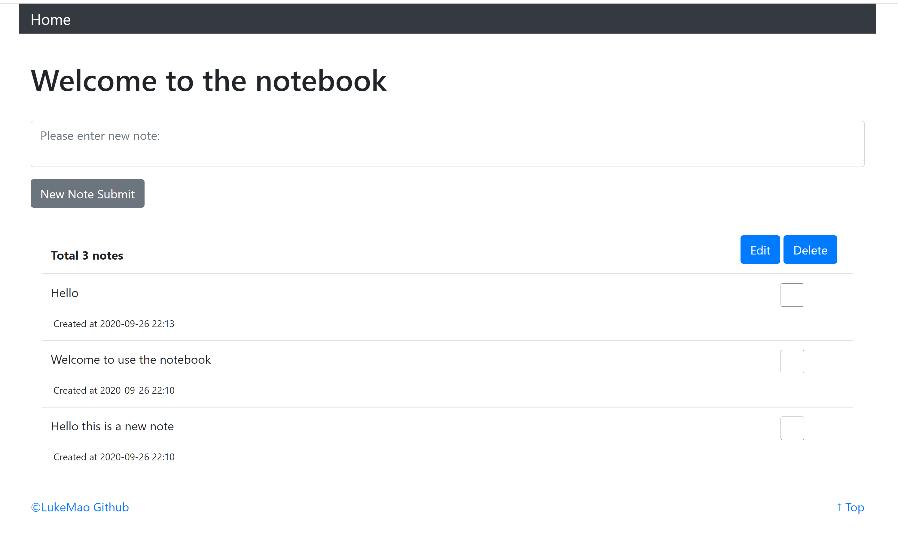

# Flask Simple Notebook Project



This is a simple flask implementation of a notebook. It supports mainly three actions:

1. Create a new note.
2. Select multiple notes to edit.
3. Select multiple notes to delete. 

The front end uses bootstrap 4. The server end uses python flask and sqlalchemy. Templates are used intensively in this project. 

## Installation

clone: 
```
$ git clone git@github.com:luke-mao/Flask-Notebook.git
$ cd Flask-Notebook
```

install all dependencies:
```
$ pip install -r requirements.txt
```

run the project:
```
$ flask run
 Running on http://localhost:9700/
```

The default port number is 9700, feel free to modify in the `.flaskenv` file. 

## Future Modification

Need to maintain the footer at the bottom position when there are few notes on the index page. 

## Reference

This project is built upon the instructions and example projects from the book **Python Web Development With Flask** by **Hui Li**.
